# Hurricane Forecasting Evaluation & Verification

## Purpose

The purpose of this study is to evaluate and verify the accuracy of hurricane precipitation forecasting. The area and period of study have been narrowed to the state of Louisiana, between the years 2000 and 2015.

## Hurricane Classification

Hurricanes are classified as severe tropical wind storms with wind speeds above 74 miles per hour (mph). From the Saffir-Simpson Hurricane Wind Scale, the intensity of a hurricane can be further classified into five categories based on their wind speed as seen in the table below (NOAA, 2017).

Table 1. Saffir-Simpson Wind Hurricane Categories

| Category | Wind Speeds (mph) | Impact                                                                                                                                                                                                   |
| -------- | ----------------- | -------------------------------------------------------------------------------------------------------------------------------------------------------------------------------------------------------- |
| 1        | 74-95             | Produces some damage. May affect structures, trees, power lines, and poles.                                                                                                                              |
| 2        | 96-110            | Cause extensive damage. Structures likely to experience damage, severe power outages expected.                                                                                                           |
| 3        | 111-129           | Cause devastating damage. Structures (i.e. roofs and frames) severely damaged, severe power and water outages expected, potentially for several weeks.                                                   |
| 4        | 130-156           | Cause catastrophic damage. Structures likely to lose roof structure and walls, residential areas likely to be isolated by power poles and tree uprooting, area likely uninhabitable for weeks to months. |
| 5        | 157 or higher     | Cause catastrophic damage. High percent of framed homes will be destroyed, power outages likely for months, area likely uninhabitable for week to months.                                                |

## Impacts of Hurricanes

Hurricanes that occur in the tropical coastal regions of the United States have proven to consistently be some of the most devastating natural disasters experienced in the country. The prevalence of hurricane-related disasters in coastal Louisiana has the potential to not only severely impact the communities living in this region, but also to drastically alter both the hydrology and topography of the surrounding landscapes. Coastal Louisiana is especially prone to large hurricanes due to its geographic location in the north-central Gulf of Mexico.

### Hydrological Impact

Strong storm events can produce severe changes to the hydrology of the area.

#### Coastal Flooding

During a storm event, coastal flooding is by far the greatest threat to life and property along the coastline. Storm surges as well as precipitation and river flow during hurricanes contribute to this flooding. A storm surge is a rising of the sea as a result of atmospheric pressure changes and wind associated with a storm. Coastal flooding and surges depend on the intensity of a storm, its size, speed, angle of approach, and landfall location. Slow and larger but weaker hurricanes can cause higher storm surges and flooding. Greater storm surges occur when storms make a perpendicular approach toward the coastline as opposed to those that travel parallel to the coastline. Storm surges of Category 5 hurricanes can reach more than 12 meters and span several hundred miles while coastal flooding can reach tens of miles inland. Buildings, levees, wetlands, sand dunes, and barrier islands can reduce storm surges and flooding, but at the same time, they may be damaged or destroyed during severe storms. Levees are designed to withstand the impacts of storms, but poorly designed levees may fail when confronted with strong hurricanes. Storm surge values are no longer assigned to a hurricane of a given intensity due to variations in water depth and topography in different coastal regions. Nonetheless, they present high risks along the Atlantic and Gulf Coast where many densely populated regions lie below sea level.

Hurricanes have played an important role in transforming Louisiana’s barrier islands and have caused up to 90% of shoreline retreats. Hurricanes are the dominant factors in causing erosion, reduction in elevation, fragmentation, and migration on Louisiana’s beaches and islands. An example of one of the most devastating storms to strike the coast of Louisiana is Hurricane Andrew in 1992. The peak's significant wave height exceeded 9 meters and severe overwash and breaching occurred along over 100 kilometers of the barrier island coastline. Beach face retreat of approximately 25 meters was evident for two years following Hurricane Andrew which also removed all the sand from the beach face of Trinity Island and caused widespread sediment deposition (Stone et al., 1997). Due to the damage of barrier islands and coastal retreat, larger waves are predicted to undergo a gradual landward shift. Predictions of future waves and storm surges indicate wave heights between 1 and 2 meters can be anticipated as far inland as New Orleans.

#### Marine Ecosystems

Other impacts caused by hurricanes include damage to marine ecosystems. Areas vulnerable to hurricanes receive prodigious amounts of rainfall during storm events. This generates large runoff volumes which are discharged to streams and canals. Hurricane events thus cause a drastic change in water levels in the impacted areas. The high stream discharges combined with wind-suspended sediments reduce salinities and water transparency in lagoons and estuaries, decreasing the water quality and fish activity (Steward et al., 2006). Severe water quality loss can follow a hurricane as a result of sedimentation and large volumes of runoff. Hypoxia (oxygen deficiency in a biotic environment) is a common issue as large concentrations of nutrients flow into freshwater channels. Damage to vegetation and fish life can take a significant amount of time to recover and may have lasting effects on the hydrology of an ecosystem.

Hurricane events can have a drastic effect on the hydrology of the affected areas, which can lead to catastrophic results for the people who live there. Water level rise and storm surges can flood low-lying areas, causing millions of dollars of damage. Destruction of marine ecosystems harms the fish life in the area. Wetlands are being considered as a potential component of flood protection by lowering surges as they propagate inland from the coast (Wansley et al., 2009). Also, methods to quantify the effect of wetlands on coastal surge levels are not fully comprehensive and the degree to which wetlands attenuate surge is highly debatable, some studies have shown that wetlands do have the potential to reduce surges. As coastal areas are highly likely to be eroded or damaged due to storm waves, it is increasingly important to find solutions to reduce the impacts of high storm events on the population. Coastal protection systems should consider both engineered systems, such as strong levees designed to withstand the impacts of strong hurricanes and high flood events, and natural features, such as wetlands.

Wetlands and other marine ecosystems, as mentioned before, have the potential to be damaged during high storm events. Without wetland restoration, Louisiana could lose about 4,548 square kilometers of wetland and other coastal land over the next 50 years (Barbier et al., 2013). But wetland restoration is expensive and estimates show an investment of $25 billion over 50 years could still result in 585 square kilometers of loss. Yet, wetland investments could potentially reduce the future vulnerability of the coast to periodic hurricane storm surges. It is important to assess the potential benefit of restoring these habitats to attenuate future storms versus the cost of rehabilitation.

### Economic Impact

Hurricane economic impacts can be categorized into direct and indirect impacts. Direct impacts are those that are caused by the hurricane, such as damage to structures, loss of life, injury, and flooding. Indirect impacts are those that occur as a result of direct impacts. The most significant of these indirect impacts include: altering the population distribution, job loss, and reduced output from industry and commerce. In severe cases, the direct and indirect impacts of a hurricane can be represented as a monetary figure.

To assess the damage caused by a hurricane event, a dollar estimate is produced encompassing the cost due to economic losses and recovery effort. Losses from a hurricane event range from loss of human life, gross state product (GSP); damage to homes, businesses, and infrastructure. In the United States, the cost of a hurricane is reported by the National Hurricane Center (NHC) as a single rough figure called the “US damage estimate.” It compiles insurance claims from the American Insurance Services Group (AISG) and the National Flood Insurance Program (NFIP) and then projects the uninsured damages as equal to the AISG estimate (i.e. US damage estimate = AISG✕2 + NFIP) (NOAA, 2007).

Much of the industry within the Gulf Coast region is vulnerable to the direct impacts of hurricane events, which have indirect impacts on the surrounding regions. Industries such as fuel export, commercial fishing, and shipping all require coastal facilities to operate. Hurricanes with sufficient damage potential can disable or induce forced shutdowns of these coastal facilities for the duration of the storm and recovery effort. Hurricanes can have substantial and long-lasting effects on the Louisiana fishing and shipping industry. The Gulf Coast region provides 29% of U.S. offshore oil production and a multi-billion-dollar fishing industry.

Since hurricanes can act as a strong drive for changes in housing and population dynamics, they can affect the core of state economies. For cities, losing residence means losing a portion of its tax base. This will likely affect future spending in disaster-affected areas.

## Hurricane Events

Within the study time period (2000-2015), a total of eleven (11) hurricanes hit the coast of Louisiana, claiming lives and causing irreparable damage both economically and hydrologically. A brief overview of each of these hurricanes and the impacts they had can be seen below.

Table 2. Hurricane Impact Summary (NOAA)

| Hurricane | Category at US Landfall | Peak Category | Peak Winds         | Year | Duration                    | Fatalities             | Damage (MUSD)   |
| --------- | ----------------------- | ------------- | ------------------ | ---- | --------------------------- | ---------------------- | --------------- |
| Isidore   | Tropical Storm          | 3             | 125 mph            | 2002 | September 14 - September 27 | 22                     | $330-$1,300     |
| Lili      | 1                       | 4             | 145 mph (230 km/h) | 2002 | September 21 - October 4    | 13 direct, 2 indirect  | $925            |
| Cindy     | 1                       | 1             | 75 mph             | 2005 | July 3- July 12             | 5                      | $320            |
| Dennis    | 3                       | 4             | 150 mph (240 km/h) | 2005 | July 4 - July 18            | 76 direct, 12 indirect | $2,545-$3,710   |
| Katrina   | 3                       | 5             | 173 mph            | 2005 | August 23 - August 31       | 1833                   | $108,000        |
| Rita      | 3                       | 5             | 180 mph            | 2005 | September 18 - September 26 | 120                    | $12,037         |
| Humberto  | 1                       | 1             | 92 mph             | 2007 | September 12 - September 14 | 1                      | $50-$100        |
| Gustav    | 2                       | 4             | 155 mph            | 2008 | August 25 - September 7     | 153                    | $4,620-$6,610   |
| Ike       | 2                       | 4             | 145 mph            | 2008 | September 1 - September 15  | 195                    | $29,520-$37,500 |
| Ida       | Tropical Storm          | 2             | 105 mph            | 2009 | November 4 - November 10    | 4                      | $9-$11.3        |
| Isaac     | 1                       | 1             | 81 mph             | 2012 | August 21 - September 1     | 34                     | $2,350          |

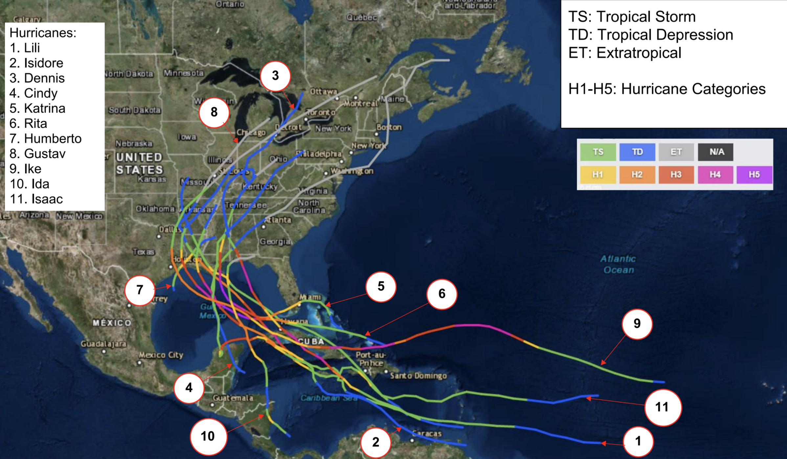

### Hurricane Isidore

Hurricane Isidore was associated with extensive precipitation in Louisiana, with the most rainfall being experienced in Metairie, where approximately 16 inches of rainfall occurred. Isidore caused extensive flooding in the Louisiana region, however by the time it reached the United States it was classified as a tropical storm. The sole fatality in Louisiana was caused by a rip current near Port Fourchon.

### Hurricane Lili

Hurricane Lili made landfall on the morning of October 3 near Intracoastal City, as a weakening category one hurricane. Wind gusts reaching 120 mph (190 km/h), coupled with over 6 inches (150 mm) of rainfall and a storm surge of 12 feet (3.7 m) caused over $790 million in damage to Louisiana including failed levees in the southeastern part of the state. Hurricane Lili also caused great environmental damage to the marshes and barrier islands in Louisiana. President Bush declared Louisiana a federal disaster area after the storm, making it eligible for assistance. Over $311 million in aid was granted to Louisiana (Lawrence, 2002).

### Hurricane Cindy

Hurricane Cindy was a tropical storm that reached Category 1 status upon landfall in the state of Louisiana. New Orleans was the most impacted city in the state, however, none of the deaths caused by Cindy occurred in Louisiana. Storm surges caused extensive flooding in New Orleans, and approximately 260,000 residents were left without power. Storm surge flooding and overwash also caused some beach erosion at Grand Isle, Louisiana.

### Hurricane Dennis

Hurricane Dennis first made landfall in the United States on the Florida Panhandle as a Category 3 storm. The storm caused far less damage than anticipated in Louisiana, though the governor still declared a state of emergency. Tides of 2-4 ft above normal were reported along the southeastern coast of Louisiana. The storm also damaged a British Petroleum oil rig that sits 150 miles (240 km) southeast of New Orleans (Beven, 2014).

### Hurricane Katrina

Hurricane Katrina was between the 4th and 5th deadliest hurricane in recorded US history. It reached its maximum lifetime intensity of Category 5 over the Gulf of Mexico and was downgraded to Category 3 at landfall on the Louisiana shores. Damage resulting from the storm surge, flooding, and strong winds was significant. Around 3 million people were left without power.

Hurricane Katrina brought 8-10 inches of rain and caused major levee breaches that led to catastrophic flooding, inundating many homes and businesses. As one of the deadliest hurricanes on record in the US, Katrina caused an extensive amount of hydrological damage to the coastal states. Most of the deaths in Louisiana were caused by the storm surge-induced flooding discussed earlier. Katrina brought storm tides over 14 feet and a 12-foot storm surge was recorded in Grand Isle. The high rainfall and storm surge caused the level of Lake Pontchartrain to rise and caused extensive flooding. Katrina obliterated entire coastal communities and cut a new canal through Dauphin Island’s western end.

At nearly three times the damage estimate of the second costliest hurricane in US history, Hurricane Katrina is in a class of its own. Unlike other hurricanes, Katrina had lasting effects on the Gulf Coast region and especially Louisiana. In the weeks following Hurricane Katrina, 80% of Gulf Coast crude oil production remained shut down for repairs (ESA, 2006). Shortages in fuel production generated speculation among consumers that shortages in fuel would follow the storm. As a result, the price of gasoline rose by 15% on the Gulf Coast, spurring an investigation by the Federal Trade Commission for perpetrators of price-gouging, in which 15 examples were identified (FTC, 2006).

The economic devastation of the loss of thousands of fishing vessels and damage to fishing processing and storage facilities was compounded by a 40% job loss in Louisiana in areas affected by Katrina (Impact Assessment, Inc., 2007). In regards to the shipping industry, Louisiana saw a loss of 3,500 jobs amounting to $136 million in lost wages (BLS, 2007).

As a result of Hurricane Katrina, 1.2 million people evacuated from the Gulf Coast region to escape the effects of the natural disaster, but only 58% returned the following year (ESA, 2006). Of the 58%, Louisiana saw a population loss of 380,000 (ESA, 2006). Adding to the difficulty of returning to a post-Katrina Louisiana, was a reduction of 143,000 housing units in the disaster-affected regions (ESA, 2006).

### Hurricane Rita

Hurricane Rita is one of the most intense Atlantic hurricanes ever recorded. It reached Category 5 status just 3 days after it formed, but quickly weakened to Category 3 status as it approached Louisiana. There was severe beach erosion at Holly Beach due to Hurricane Rita.

As Rita hit soon after Katrina, already damaged infrastructure was worsened by this hurricane. Low-lying communities were inundated due to the overtopping of levees. Hurricane Rita caused $8 billion in damages in Louisiana alone. In 2006, the Senate Budget Committee appropriated 123 billion dollars for spending on recovery efforts along the Gulf Coast following Katrina and Rita (ESA, 2006). In the months following Katrina and Rita, Louisiana was the only state experiencing a declining GSP, while the national average was 3.5% (ESA, 2006). Though the decline in GSP due to the hurricanes could not be confirmed, it is likely, since the GSP took a dive from 6 previous quarters of a steady $120 billion to $63.5 billion (ESA, 2006).

Louisiana is estimated to have lost $1.6 billion in the fishing industry over the 12 months following hurricanes Katrina and Rita (NYT, 2005). To provide an idea of the extent of the damage to Louisiana fishing, 70% of commercial fishing facilities in Eastern Louisiana remained closed for at least 6 months following Katrina and Rita (ESA, 2006). Commercial fishing revenue declined 32% 2-3 months following Katrina from the same period in the previous year (Impact Assessment, Inc., 2007).

### Hurricane Humberto

Hurricane Humberto is notable for its rapid intensification near the coast of Texas from a tropical depression to a category 1. Humberto mainly impacted uninhabited areas as well as areas still recovering from Hurricane Rita, which explains the relatively low damages and casualties. Rainfall in Louisiana peaked at 8.25 inches and caused minor flooding (NOAA).

### Hurricane Gustav

Hurricane Gustav began as a tropical storm but quickly strengthened to a Category 4 hurricane on August 26, 2008. Due to wind shear and dry air, Gustav weakened to a Category 2 hurricane and remained at this intensity as it reached Louisiana on September 1, 2008. Gustav resulted in 48 deaths in Louisiana and left around 1.5 million people without power.

### Hurricane Ike

Hurricane Ike was the third-costliest Atlantic hurricane, trailing behind Sandy and Katrina. It developed from a tropical wave on September 1 and strengthened to a Category 4 hurricane on September 4. Areas in coastal south-central and southwestern Louisiana which were flooded by Gustav, were re-flooded due to Ike. Ike caused flooding and damage along the Mississippi River and the Florida Panhandle.

### Hurricane Ida

Ida was the strongest landfalling tropical cyclone during the 2009 Atlantic hurricane season. It formed on November 4 and although weakened over land, it re-strengthened in the Yucatán Channel. By November 8th, Ida obtained Category 2 status and soon after Louisiana, Alabama, and Florida all declared a state of emergency, and extensive evacuations were conducted.

### Hurricane Isaac

Hurricane Isaac made landfall in Haiti and Cuba as a tropical storm and hit the U.S. via Louisiana as a category 1 hurricane. In Louisiana, Isaac caused storm surges that peaked at 11.03 feet above normal tide levels resulting in significant inland flooding. In addition, heavy rainfall that peaked at 20.66 inches in Louisiana caused moderate to record flooding in several rivers (NOAA). Strong winds and storm surges during Hurricane Isaac forced the Mississippi River to flow backward for 24 hours.

## Evaluation of Hurricane Forecasting

Forecasting the likelihood of a hurricane is extremely important to provide adequate time for communities to prepare or evacuate if they are in the path of these storms. Besides the direct results from high wind intensities and high levels of precipitation, other hydrological consequences such as storm surges and flooding also have the potential to cause a significant amount of harm.

Although the high wind speeds of a hurricane can be extremely devastating, a sizable proportion of hurricane deaths occur as a result of the subsequent flooding caused by the increased precipitation associated with hurricanes. Forecasts will typically focus on the track and intensity (i.e. wind speed) of a storm, however, information about the expected quantity of precipitation associated with these events can also provide the public with the opportunity to better prepare for the damage that may be caused. Thus, hurricane precipitation forecasts play an essential role in reducing such vulnerability to hurricane-related hazards.

## Forecast Verification

While hurricane tracking has improved significantly over the years, accurate prediction of rainfall from hurricanes remains a major challenge in hurricane forecasting. Advancements in validation techniques are an important first step in improving precipitation prediction. There are a variety of metrics used to verify forecasts.

Verification requires not only the spatial and temporal data predictions but also the actual observations associated with the same spatial and temporal reference points. For precipitation forecast verification, the persevering goal is to determine how accurately a forecast can predict a certain amount of precipitation as compared with the actual measured precipitation. However, several other metrics provide insight into not only the accuracy of a forecast, but also its tendencies to over or under-predict an event (i.e. the bias of a forecast), the uncertainty or degree of variability in the observations, and the overall skill. These values can be extremely helpful in determining which forecasts can be the most useful in providing early warning systems to the public.

### Forecasting Methods

There have been great attempts by the North American Oceanic and Atmospheric Administration (NOAA) to improve hurricane forecasts in the United States. In 2009, NOAA formulated an interagency collaborative program to increase the accuracy of hurricane forecasts in the Atlantic Basin of the United States. This program, called the Hurricane Forecast Improvement Program (HFIP) set a goal of an error reduction in track and intensity forecasting by 20% in 2014 and a 50% reduction by 2019. HFIP has been relying on its own data, other agencies, and the scientific community at large to meet this goal (NOAA, 2017).

#### Ensembles

Ensemble forecasts are the most widespread type of forecasts typically used in the United States. Rather than predicting the exact location of the storm with a single forecast, an ensemble provides a range or set of potential events. Single forecasts are bound to have an extensive range of inaccuracy, especially when seeking to make an accurate prediction far in advance, due to the high extent of variability in fluid dynamics (for both air and water). Ensemble forecasts, on the other hand, acknowledge that there will be atmospheric, oceanic, and model variability. An ensemble forecast will then take the means and variances of multiple individual forecasts, and formulate them into one to increase accuracy. An ensemble forecast will in turn provide a range of possible outputs. The smaller the range provided by an ensemble, the better the forecast. Ensembles also provide an advantage over individual forecasts because they provide a range of uncertainty from the start (WMO, 2012).

### Track and Intensity

One of the most prevalent issues with hurricane forecasting is determining a model that can accurately portray the path of a hurricane while simultaneously predicting the intensity. The majority of hurricanes will cover large expanses of space, often encompassing a horizontal area of over 100 kilometers and a vertical height of over 20 kilometers. This wide range of space requires that models that forecast hurricanes require an immense amount of computational data. Typically, the forecasting of hurricanes will utilize statistical and physical models to interpret the likelihood of an event occurring in a specific place. Many of these models will put different portions of the storm into a three-dimensional grid to determine what path a hurricane is likely to take and where it is bound to have impacts on coastal communities. Some of these forecasts can have path errors in the range of 100 kilometers. This inability to predict where a hurricane will land can have devastating consequences for a community ill-prepared to withstand the impacts caused by these events.

#### Forecast-oriented Low Ocean Resolution

##### Methodology

One of the main models utilized throughout the United States is the Geophysical Fluid Dynamics Laboratory (GDFL) Forecast-oriented Low Ocean Resolution (FLOR) model. GFDL models have been utilized in the United States since 1995. In the studies performed by Murakami et al., the FLOR model was coupled with statistical probabilities of hurricane paths to predict hurricane paths and intensities from 1980-2014. FLOR is a dynamic model with meshed land, ice, and sea components. The FLOR model is composed of 32 vertical layers, however, all initial conditions are based on oceanic and oceanic ice conditions. In this sense, the ocean is the main driver for the model, however, the model also measures atmospheric fluxes, which take into account the precipitation and wind fluxes that can occur during a hurricane. FLOR models contribute to the North American Multi-Model Ensemble (NMME) databases and data utilized by the National Hurricane Center and are one of the few models that can accurately predict hurricane intensity. Coupled with statistical “best-track” models provided by NHC, the FLOR model can provide a step-by-step analysis of the track and corresponding intensities of certain hurricane events. Murakami et al. utilized four different clusters managed by an algorithm to analyze the accuracy of the model in different regions (Murakami et al., 2016).

##### Results

The forecasts completed by Murakami et al. provided various results. As seen in Figure 2 below, the accuracy of the clusters varies on the region. The FLOR models have a much wider range of significance than the actual storms, and the cluster chosen has a significant impact on how close the forecast is to the actual hurricane event. Murakami et al. found that Cluster 3 had little to no skill in predicting storms, however, Cluster 2 had a high level of skill, especially when determining what effects a hurricane will have upon landfall. It is significant to note that Cluster 2 is geographically representative of the Gulf of Mexico and the Caribbean, and could be relevant when forecasting Louisiana storms. Each cluster also varies widely spatially, however, Cluster 2 again proves to be the best model because of its accurate scope of the storm path.

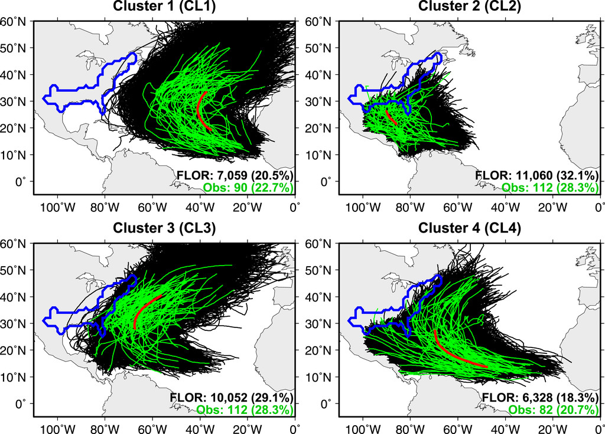

#### Hurricane Weather and Research Forecast

##### Methodology

Another model used frequently in North American hurricane forecasting is the Hurricane Weather and Research Forecast (HWRF). HWRF was first utilized by the NHC in 2007 as a means to improve hurricane forecasts in real-time. Like the FLOR model, HWRF creates a nested grid to begin the model simulation. The HWRF model has a 9-kilometer horizontal resolution with 42 vertical levels. Unlike the FLOR model, on the other hand, the HWRF model seeks to incorporate real-time satellite imagery to continuously update both initial and boundary conditions. HWRF has the potential to increase accuracy by continuously updating the initialization process within the model. Since its inception in 2007, HWRF models have been updated yearly to increase the accuracy of boundary conditions along with providing numerical improvements to microphysics and computational power. The HWRF model has been seeking to reduce track and intensity errors by 50% by 2020 per the HFIP goals (Tallapragada et al., 2015).

##### Results

As seen in Figure 3 below, the ability of the HWRF model to predict both the track and intensity of hurricanes has been improving with each subsequent HWRF model. The 2014 HWRF model has reached the 5-year goal of a drop in error by 20% and has the potential to reach the 10-year goal of an error decrease of 50% by 2019.

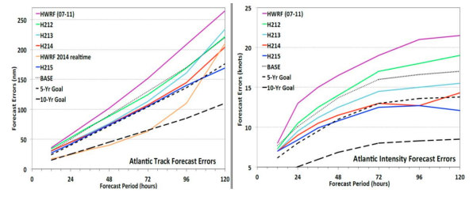

#### Multi-scale Environmental model with Grid Adaptivity

##### Methodology

Another forecasting model recently utilized in hurricane prediction was the Operational Multi-scale Environmental model with Grid Adaptivity (OMEGA). OMEGA is an adaptive model that uses an unstructured triangular prism grid rather than a traditional cubic grid to model potential hurricanes. OMEGA utilizes physical characteristics such as longwave radiation and water microphysics to establish cloud characteristics and wind intensities during the formation of a hurricane, while also incorporating surrounding boundary conditions with multiple dispersion models. Under the assumption of atmospheric stratification, the unstructured grid of the model is fixed in the vertical direction and allows for more variability in the horizontal direction. With these parameters, the OMEGA model looks at atmospheric convection to provide a model that mimics the wind and water flow experienced in a hurricane. [Gopalakrishnan](https://www.google.com/url?q=http://journals.ametsoc.org/author/Gopalakrishnan%252C%2BS%2BG&sa=D&ust=1606077043734000&usg=AOvVaw1v9ERQXmzvh9Fd_MXMyFzV) et al. utilized the OMEGA model to evaluate eight previous storms on the Gulf of Mexico and the Atlantic to determine the accuracy of the model ([Gopalakrishnan](https://www.google.com/url?q=http://journals.ametsoc.org/author/Gopalakrishnan%252C%2BS%2BG&sa=D&ust=1606077043734000&usg=AOvVaw1v9ERQXmzvh9Fd_MXMyFzV) et al. 2002).

##### Results

When [Gopalakrishnan](https://www.google.com/url?q=http://journals.ametsoc.org/author/Gopalakrishnan%252C%2BS%2BG&sa=D&ust=1606077043737000&usg=AOvVaw0yJfLPeH8M7OTeAPSxdpCQ) et al. utilized the OMEGA model on eight previous storms, it was found that OMEGA forecasted the specific storms approximately 20% better than those forecasts provided by the National Hurricane Center. It was also determined that the OMEGA system was more accurate in determining large-scale predictions about precipitation and that OMEGA-simulated storms often gave more information about conditions surrounding the storm. Although the model functioned well when compared with real data, there was no instance mentioned in the paper where forecasts were utilized in real-life situations. Even with increases in accuracy and intensity, the paths of the OMEGA-simulated storms still had track errors of up to 58 kilometers. ([Gopalakrishnan](https://www.google.com/url?q=http://journals.ametsoc.org/author/Gopalakrishnan%252C%2BS%2BG&sa=D&ust=1606077043737000&usg=AOvVaw0yJfLPeH8M7OTeAPSxdpCQ) et al. 2002).

#### High-resolution Finite Volume General Circulation

##### Methodology

A high-resolution finite volume general circulation model (fvGCM) is used at the NASA Goddard Space Flight Center and Ames Research Center for hurricane forecasting. The model is based on a finite volume dynamical core with terrain-following Lagrangian control volume discretization. This model allows for better global resolution, which helps to more realistically represent tropical storms. The fvGCM resolves problems such as erratic track, abrupt re-curvature, intense extra-tropical transition, multiple landfall and re-intensification, and interaction among vortices experienced in other models (Atlas et al. 2005).

##### Results

The fvGCM was used to forecast several hurricanes including Gustav (2002) and Isidore (2002), as shown in the figures below. This model relies heavily on the initial conditions available. This is shown in Figure 4, in the initial forecast, Gustav is not yet present in the initial conditions, so the projected path is not following the actual path of the hurricane. The second run, however, is much closer to the actual path, due to a better-defined vortex in the initial conditions. This dependence on initial conditions is illustrated again in Figure 5, where the initial conditions were very poorly defined (Atlas et al. 2005).

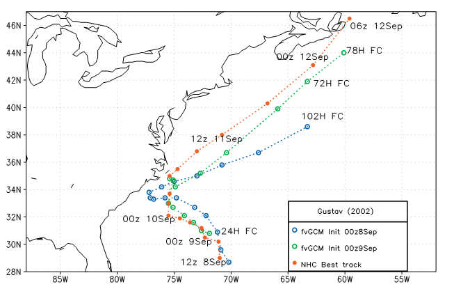

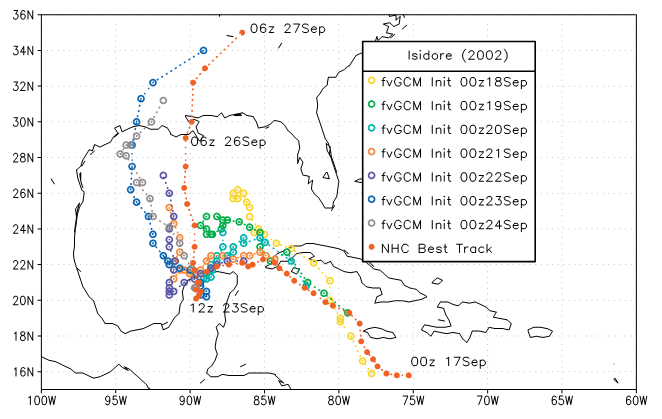

#### Bayesian Model Averaging

##### Methodology

One of the most difficult parts of hurricane forecasting is determining which model is best to use. Standard practice has been to select one “best” model and has ignored the uncertainty of this model selection procedure. For this reason, an alternative has been developed, called Bayesian Model Averaging (BMA). The BMA procedure assumes that all models created are capable of explaining the collected data in some way, so it is better to use them all. BMA takes each model and averages the predictions from each. It assigns a weight to each prediction, giving greater weight to predictions from models with the higher posterior probability, which is essentially the likelihood of the model producing the observed data. This effectively produces a consensus forecast (Jagger and Elsner 2010).

The improvement in predicting the intensity of hurricanes has been slow-moving compared to the improvements in forecasting the storm's position. HFIP was organized by NOAA to address the challenge of improving forecasts of hurricane intensity. The goal of this project was to decrease the grid spacing in the model from about 10 kilometers to 1-4 kilometers and produce an improved intensity and structure prediction, without decreasing the accuracy of the track forecasts. This enhanced resolution was achieved by using moveable, nested grids. (Davis et al. 2010).

##### Results

When Jagger and Elsner compared the consensus forecast model to several single “best” models, it was found that Bayesian Model Averaging (BMA) provided a more accurate prediction than the single best models. They performed many cross-validation exercises and it was found that the BMA procedure outperforms other model selection procedures in producing a more accurate forecast. It is noted that, although the consensus forecast will not always give the smallest forecast error, it will always provide a better assessment of forecast uncertainty as compared to a forecast from a single best model (Jagger and Elsner 2010).

Davis et al. studied the impact of increased horizontal resolution on the improvement of hurricane forecasting. They compared the results produced by the high-resolution (nested) forecast to forecasts with 12-kilometer grid spacing. The results produced compared the position and intensity forecasts of each model. For position forecasts, little difference was found between the nested and 12-kilometers forecasts as shown in Figure 6. Storm intensity was slightly better forecast in the nested simulations than in the 12-kilometer forecasts, as shown in Figure 7. The nested forecast proved most beneficial for storms of category 3 or greater intensity (Davis et al. 2010).

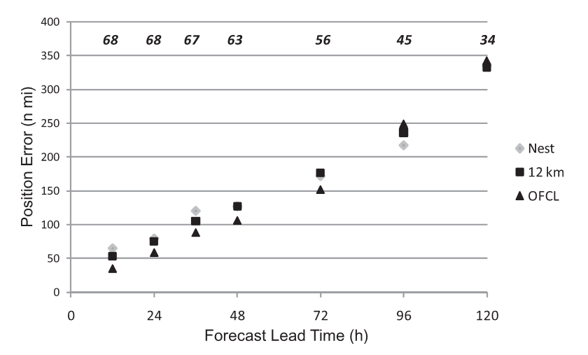

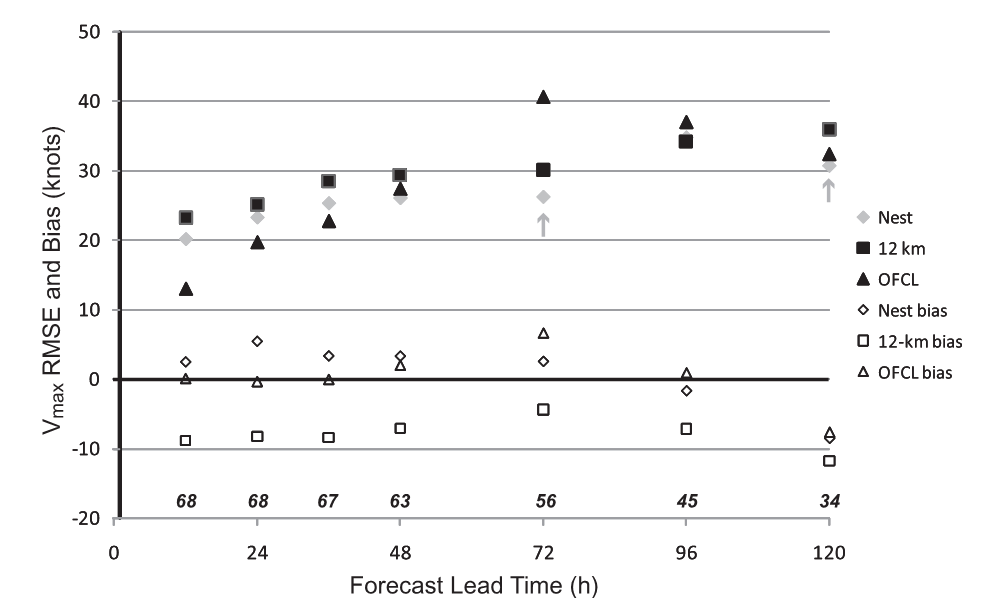

##### Discussion

As seen by the data provided above, there are several methods utilized to forecast the track and intensity of different hurricanes. Although there are similarities among many of the models, each model utilizes different conditions to provide accurate results.

One of the most influential restrictions on track and intensity forecasts are the initial conditions and boundary conditions input into the model. All of the literature cited difficulty in the initialization process. The initialization process essentially requires extremely accurate initial conditions, which can be difficult to parameterize when one is unsure where the eye of the storm is located and what kind of oceanic and atmospheric conditions exist at the time. Some of the more accurate models, like the HWRF, found more success in forecasting when real-time remote sensing data was incorporated into the model. Unfortunately, this need for real-time data can inherently create a lag between satellite data and the model, which can be detrimental when trying to provide accurate forecasts to communities that may be affected by these storms. Increasing the ability to quickly incorporate satellite data into these models could be an integral part of predicting hurricane conditions. Better data, especially that which can portray conditions at the center of the storm have the potential to dramatically increase forecasting capabilities.

Another issue that many of these forecasting methods experience is a lack of computational power. The further discretized the three-dimensional storm is, the more computation is required. Because of all the information and parameters that must be input into these models (i.e. physical restrictions, boundary conditions, fluxes, oceanic conditions, and atmospheric conditions), it is easy to see how quickly a system may become bogged down by an excess of input information. Those forecasts that use smaller discretizations in the horizontal plane (i.e. are of a higher resolution) may not necessarily provide more accurate results as seen in the study performed by Davis et al. Therefore, there must be more analysis to determine which inputs have a more significant influence on the actual accuracy of the forecast.

Due to the large expanse that most hurricanes cover, it is easy to see why it may be so difficult to accurately portray hurricane paths. For a hurricane that influences over 100 kilometers, even the smallest error in track estimation can de-rail the forecast by tens of kilometers. The accuracy of hurricane forecasts also increases when the length of the forecast decreases. This is because the decreased time step allows for more data to be gathered, and for initial conditions to be better evaluated. Ultimately long-term forecasts are preferred because they allow the public more time to prepare, but are more difficult to produce accurately. Incorporation of multiple models into ensemble forecasts may in the future allow for better long-term forecast accuracy.

Although there have been tremendous improvements in increasing the accuracy of hurricane forecasts, there is still relatively little data to compare these forecasts to actual hurricane data. Between the years 2000 and 2010, only 11 hurricanes occurred in the Atlantic Basin (NOAA, 2017). This means that the accuracy of certain forecasts only has a very limited number of actual data sets to compare to. Unfortunately, this means that error reduction in these models is likely to occur as more hurricanes occur.

### Streamflow and Storm Surge

Understanding flood response to hurricane storms is a key component in effective reservoir management, water resource allocation, and risk assessment in affected watersheds (Chen, et al. 2015). The geometrical and hydrodynamic complexity of the coastal Louisiana region creates a challenge for correctly modeling hurricane-induced flooding. The accuracy of the models developed closely depends upon the selected domain, physics, computational resolution, algorithms, and the speed of the software and hardware. A specific and significant challenge in modeling streamflow response to hurricane-season storms is the large variance present, highlighted in Figure 8 by the grey-shaded column. Despite the challenges present, models have been developed to provide increasingly accurate streamflow forecasts, and research has been conducted to deepen our understanding of the roles of the contributing physical processes.

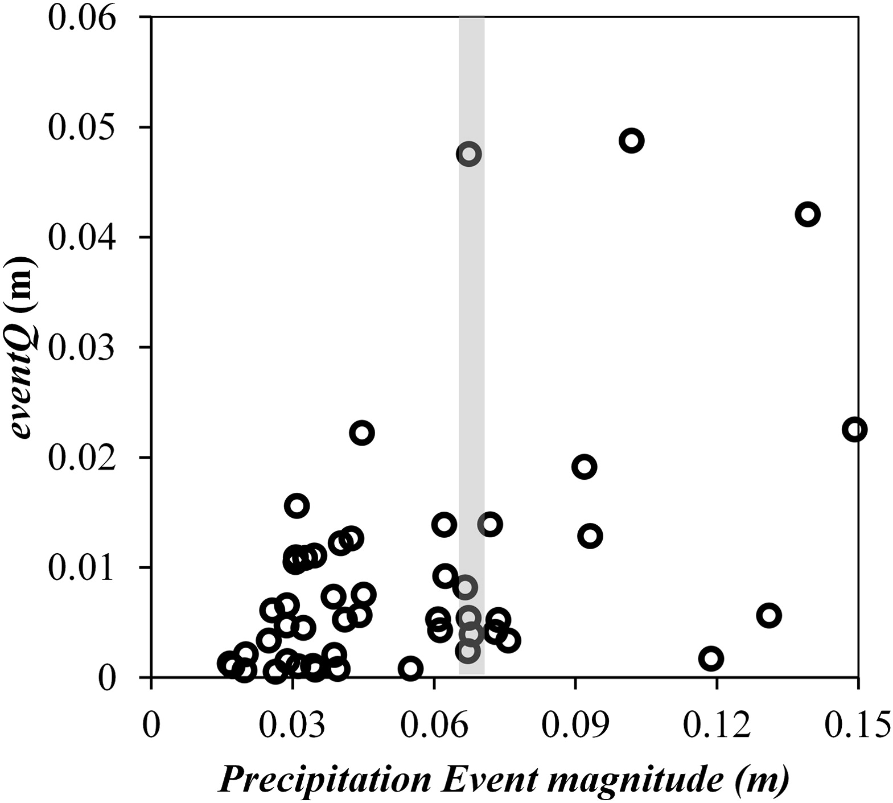

#### Penn State Integrated Hydrologic Model

##### Methodology

Coastal surge and flooding are caused by a variety of complex processes, including wind, atmospheric pressure gradients, tides, river flow, short-crested wind waves, and rainfall. The Penn State Integrated Hydrologic Model (PIHM), a physically based distributed hydrologic model developed by Kumar et al. in 2009, was used to identify and evaluate dominant hydrologic controls on streamflow amount variability. The North American Land Data Assimilation System (NLDAS-2) provided hourly climate data for the model, including precipitation, temperature, relative humidity, wind velocity, solar radiation, and vapor pressure (Chen, et al. 2015). These datasets, and a closely coupled GIS framework, were used to parameterize the model domain. Wind-driven coastal surge from large hurricanes was discovered to be the most influential contributor to devastating regional flooding. Maximum high water levels were also influenced by atmospheric pressure, tides, riverine currents, waves, and rainfall.

##### Results

The Penn State Integrated Hydrologic Model (PIHM) and supporting dataset indicate that variability in flood response in the study area (Lake Michie watershed) is primarily driven by antecedent soil moisture conditions near the land surface and evapotranspiration during post-event streamflow recession periods. These parameters are functions of precipitation history and prevailing vegetation and meteorological conditions (Chen, et al. 2015). The results and analyses of the study can help prioritize measurements during future observation and remote sensing campaigns.

#### Advanced Circulation

##### Methodology

The variability and large rainfall and storm surge events resulting from hurricanes make them particularly difficult to model, but the large hydrological and economic impacts have necessitated research into competent models. Now, forecasting models are being used to resolve the features important to storm surge propagation on a local scale while providing accurate model forcing and parameterization of physical processes. One such model, developed by Westerink et al., utilizes a basin-to-channel scale unstructured grid hurricane storm surge model. The Advanced Circulation (ADCIRC) basin to channel-scale unstructured grid circulation model is also used in the high-resolution coupled riverine flow, tide, wind, wind wave, and storm surge model developed by Bunya, et al. and combines several popular models in one to leverage all of their strengths. The second of which is the NOAA Hurricane Research Division Wind Analysis System (H\*WIND), a distributed system that uses real-time observations of storms in an object-relational database. The measurements are adjusted to a common framework, and then graphically display the data. The Wave Model (WAM) was also incorporated to generate deep-water wave fields and directional spectra. The Wave Model (WAM), a discrete spectral wave model, was used to solve the wave action balance equation (Bunya, et al. 2010). The Interactive Objective Kinematic Analysis (IOKA) was utilized in kinematic wind analyses. The Steady-State Irregular Wave (STWAVE) model generated a nearshore wind wave model by solving the steady-state conservation of spectral action balance along backward-traced wave rays (Bunya, et al. 2010).

##### Results

The ADCIRC model used by both Westerink et al. and Bunya, et al. was validated using hindcasts that produced a 0.43 mean peak surge error for Hurricane Betsy and 0.27 for Hurricane Andrew. Comparisons of the modeled to observed peak storm surges show that the model on average lies approximately 10% below the observations. A final model skill assessment demonstrates the peak storm surge height estimates have a mean absolute error of 0.30m. Model errors appear to be mostly associated with regions where topographic data are sparse and where raised features have not been included in the model grid. A similar error was also encountered by Bunya, et al. in developing their high-resolution coupled riverine flow, tide, wind, wind wave, and storm surge model. Bunya et al. discovered that their model severely under-predicted surge analysis in upland locations in the vicinity of steep topography.

Therefore, while ADCIRC is useful in predicting storm surge, a major factor of inland inundation during hurricanes, it is sensitive to accurate topographical data. A further challenge exists in the ability to apply these models to the many areas impacted by hurricanes, which have widely varying hydrological and topographic parameters. However, as available data improves, models will reach greater levels of accuracy and be able to help design better storm protection infrastructure to reduce risk and damages in hurricane-prone areas.

## Verification of Forecast Data

### Methodology

All of the hurricanes that occurred in Louisiana between the years of 2000 and ­2015 are included in this report, however, the focus of the verification analysis is narrowed to three of the major hurricanes that occurred. These were hurricanes Isidore in 2002, Katrina in 2005, and Gustav in 2008. The rationale behind selecting these three hurricanes was to compare ensemble performance across different years to see whether ensemble prediction improved over time. Forecasting verification was performed using a measure-oriented approach.

### Data Collection

Hurricane forecasting improvements in recent years are due largely in part to the greater availability of satellite observations. The precipitation data used in this study was gathered by satellites in the NASA Tropical Rainfall Measurement Mission (TRMM). This data was organized into Network Common Data Form (NetCDF), which collects array-oriented scientific data and packages it using a program developed at the University Corporation for Atmospheric Research (UCAR). The precipitation data was then compared to the regional climate model data provided by the National Center for Atmospheric Research (NCAR) Climate Data Gateway.

### North American Multi-Model Ensemble

This study focuses on ensemble models, specifically the North American Multi-Model Ensemble (NMME). The NMME is an experimental multi­model seasonal forecasting system consisting of coupled models from several US modeling centers. Its data set aims to forecast precipitation trends during each season, i.e. provides overall forecast trends in the winter, spring, summer, and fall. Because NMME forecasts are seasonal, they have not traditionally been used to predict hurricane precipitation but can help determine seasonal trends that may occur during the normal hurricane season (Harnos et al., 2017). While measurements obtained by NMME forecasts may provide some insight on a seasonal basis, hurricanes often form too quickly for NMME forecasts to predict accurately, so alternative forecasting techniques that are capable of making predictions on a shorter time scale may be necessary (Jia et al., 2014). NMME consists of seven models, each with a different number of ensembles.

The main source of precipitation forecast information utilized in this study is data provided by the Canadian Center for Climate Modeling and Analysis’ fourth-generation general atmospheric circulation model (CanCM4), which is one of the seven models utilized in NMME forecasts. The CanCM4 model consists of a total of ten different ensembles. All ten different CanCM4 ensemble models were analyzed for each hurricane within the study time period. Each of these ensemble models contained forecasts at nine different lead times. NetCDF NMME data was analyzed within the date range that the hurricane was active. Another NetCDF file that provided the longitudinal and latitudinal boundaries of Louisiana was used in order only to focus on the precipitation data provided within the state of Louisiana alone.

A summary including the eleven hurricanes that occurred during this period, the associated dates of NMME data analyzed, and the peak date with the highest wind intensity provided by the National Oceanic and Atmospheric Administration (NOAA) can be seen in the following table.

Table 3 . List of Hurricanes that occurred from 2000 to ­2015 and associated storm date.

| Name     | Storm Duration                         | Peak Date         |
| -------- | -------------------------------------- | ----------------- |
| Isidore  | 14 September 2002 to 27 September 2002 | 26 September 2002 |
| Lili     | 21 September 2002 to 4 October 2002    | 3 October 2002    |
| Cindy    | 3 July 2005 to 12 July 2005            | 6 July 2005       |
| Dennis   | 4 July 2005 to 18 July 2005            | 10 July 2005      |
| Katrina  | 23 August 2005 to 31 August 2005       | 29 August 2005    |
| Rita     | 18 September 2005 to 26 September 2005 | 24 September 2005 |
| Humberto | 12 September 2007 to 14 September 2007 | 13 September 2007 |
| Gustav   | 25 August 2008 to 7 September 2008     | 1 September 2008  |
| Ike      | 1 September 2008 to 15 September 2008  | 13 September 2008 |
| Ida      | 4 November 2009 to 10 November 2009    | 10 November 2009  |
| Isaac    | 21 August 2012 to 3 September 2012     | 29 August 2012    |

### Temporal Analysis

To perform the temporal analysis of the hurricane forecast data, the spatial difference was eliminated. This was achieved by selecting the day with the highest observed precipitation and finding the location of the maximum precipitation within Louisiana associated with that day. The trends between lead times 0, 4, and 8 months were assessed to see whether ensemble predictions improved with shorter lead times. In addition, ensemble predictions were averaged together for each lead time. The precipitation value for each day of the hurricane at the selected location was plotted and compared against the observed value during the same time period. The time period examined for each hurricane included the dates of hurricane activity according to the NOAA hurricane tracker plus a one-week buffer both before and after.

The relative performance of the ensembles concerning lead time was assessed using the mean square error (MSE) and the bias ratio (BR). These statistics were determined with the following equations, where f denotes forecasted values and x denotes observed values.

1. MSE(f,x) = Σ(fi − xi)^2 / n for i = 1,2,3..., n
2. BR = μ(f) / μ(x)

### Spatial Analysis

The scaling error for hurricanes that occurred in Louisiana between the years 2000 and ­2015 was determined by analyzing the date that the hurricane displayed the strongest winds (peak date), according to the observed data provided by NOAA. Once the peak date was determined, an average of the forecasts for each ensemble throughout space was taken. Next, the maximum precipitation value on the peak date in the observed data was determined and compared to the precipitation in the location where the observed precipitation was the highest (peak precipitation). This comparison demonstrates the difference between the observed data and the forecasted data at a given point spatially.

The scaling error was determined according to equation (1):

1. Scaling Error at Location of Peak Precipitation = TRMM observation at peak date and peak precipitation / Ensemble forecast at peak date and peak precipitation

The scaling error is a useful statistic as it highlights the factor the ensemble forecast data was undervalued as compared to the observed TRMM data. A scaling error was also mapped for hurricanes Isidore, Katrina, and Gustav at a lead time of zero months according to equation (2):

2. Scaling Error = TRMM observation at peak date / Ensemble forecast of precipitation at peak date

A mean ensemble was generated using the spatially averaged composite of the ten CanCM4 model outputs of precipitation during hurricane events. This mean ensemble was created to obtain a general sense of forecasting capabilities. The only observed TRMM data utilized in this portion of analysis is that which occurred on the peak day of precipitation, or the day that would have the most dramatic hydrological effects.

### Results & Data Analysis

The time series of precipitation for hurricanes Isidore, Katrina, and Gustav at lead times of 0, 4, and 8 months are shown below. Due to the small values for the ensemble models, the forecasted values were squared and plotted against the observed data to better visualize the peaks in the forecasted data.

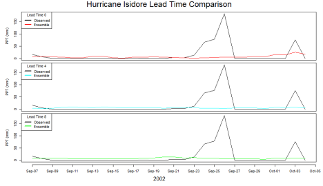

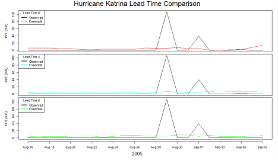

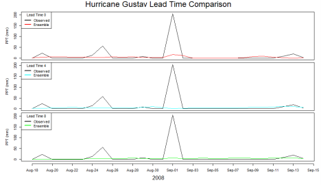

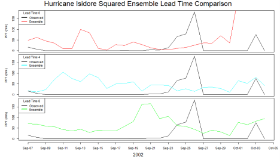

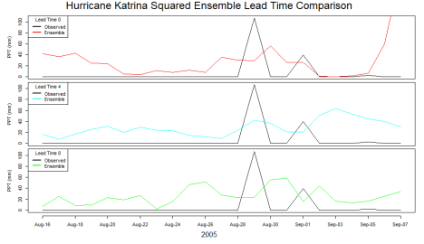

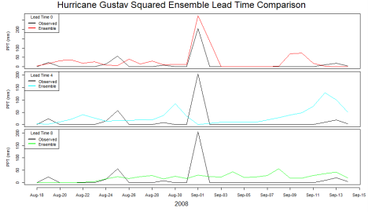

Table 4. Statistical error data for hurricanes Isidore, Katrina, and Gustav at lead times 0, 4, and 8 months

Isidore (2002)

| Lead Time | MSE  | Bias Ratio |
| --------- | ---- | ---------- |
| 0         | 1598 | 0.45       |
| 4         | 1654 | 0.41       |
| 8         | 1593 | 0.48       |

Katrina (2005)

| Lead Time | MSE | Bias Ratio |
| --------- | --- | ---------- |
| 0         | 528 | 0.71       |
| 4         | 518 | 0.80       |
| 8         | 532 | 0.74       |

Gustav (2008)

| Lead Time | MSE  | Bias Ratio |
| --------- | ---- | ---------- |
| 0         | 1435 | 0.33       |
| 4         | 1637 | 0.41       |
| 8         | 1569 | 0.34       |

### Scaling Error

The observed and forecasted precipitation data was viewed, compared and analyzed using R and Matlab. The figures below show the scaling error at the peak location on the peak day of all ten hurricanes that occurred between the years 2000 and ­2015 at lead times of 0, 4 and 8 months, respectively.

#### Scaling Error at Location of Peak Precipitation

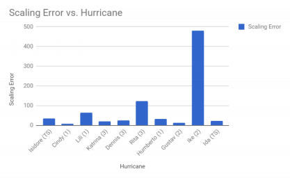

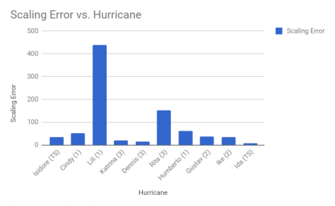

##### Scaling Error ­at Lead Time 0

For the purpose of this study, spatial error maps were only included in the figures below for Hurricanes Isidore, Katrina, and Gustav at a lead time of zero months.

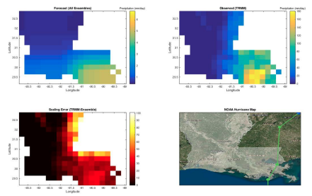

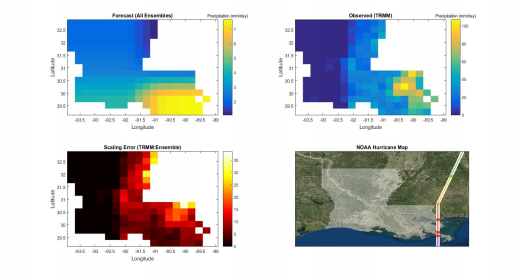

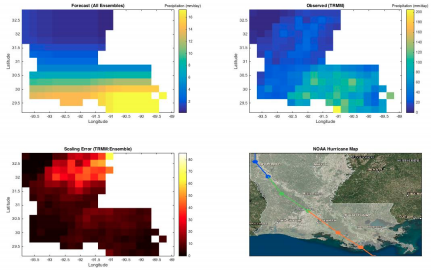

### Discussion

#### Temporal Analysis

The averaged ensemble forecast was drastically under-predicting the hurricane precipitation, however, there could still exist some potential for predicting when the peak precipitation occurred. By squaring the averaged ensemble forecast values, any peaks present will be favored and exaggerated. Squaring the averaged ensemble forecast has the potential to show a temporal trend, however, it is not guaranteed to provide a valuable precipitation scale. By favoring the peaks in the forecast, it can also be easier to recognize any temporal shifts present.

Isidore’s mean squared error does not decrease with decreasing lead time and shows no trend proving that the accuracy of the forecast data increases as the hurricane approaches. Looking at Figure 12, it can be seen that the ensemble model did not predict the occurrence of the hurricane regardless of the lead time. At lead time 8, there was an increase in the forecast precipitation value around September 20, which is a few days before the observed peak value on September 26. Lead time 0 shows a high precipitation event after September 30. None of the lead times were able to predict a large precipitation event occurring at the time of the hurricane.

Katrina’s MSE was similar across all lead times. The ensemble models do show a slight increase in the predicted precipitation value during the peak days of the hurricane but do not show any significant peaks that would indicate a high precipitation event at this time. At lead time 0, a high precipitation value was predicted after September 6. Louisiana experienced the highest rainfall from Katrina on August 28. The ensemble was unable to predict the approach of Hurricane Katrina.

Gustav’s MSE values show that the lowest error was calculated for lead time 0. As expected, the closer it is to the hurricane event, the more accurate the forecast data should be. Gustav hit Louisiana in 2008, meaning ensemble models could have been improved since the time of Isidore and Katrina. When looking at the plot of observed data versus the square of the forecast data, it can be seen that at lead time 0 the ensemble was able to predict the occurrence of a high precipitation event on September 1. At lead time 8, no significant hurricane event was predicted by the ensemble. At lead time 4, a small hurricane event was predicted around August 30, but the model predicted an even higher precipitation event around September 12, which turned out to be a false alarm. The ensemble was able to accurately predict the occurrence of a high precipitation event for Hurricane Gustav at lead time 0.

Between lead times, there is no strong evidence that decreasing lead time produces a more accurate forecast since the MSE typically did not show a decreasing trend. The ensembles performed poorly at predicting when hurricane events would occur. Gustav shows a promising trend in that the lowest lead time, 0, has the lowest MSE, possibly due to improvements in ensemble models, and the ensemble successfully predicted the hurricane event. However, the ensembles were still unable to predict large rainfall events at large lead times, which would give communities more time to react and protect themselves against the storm. The bias ratio has the potential to redeem inaccurate data by helping to determine a scaling factor. If the bias is consistent then the data can be scaled to give a more accurate prediction. The averaged ensembles were consistently under-predicting for each hurricane, although by slightly different amounts. This trend could potentially give the forecasts more potential. However, it is also important to note that the bias ratio is not always helpful if many small values are present.

For a more complete temporal analysis, it might have been beneficial to have more buffer time before and after hurricane activity. A one-week buffer was sufficient to see the trends near the peak precipitation in the observed data, however, a longer time series might have yielded better statistics from the larger sample size. Additionally, there may be a time shift present in the forecasted data that wasn’t seen with a one-week buffer but is unlikely.

#### Scaling Error

As seen in Figures 15-17, there were few trends found in determining the scaling error of the ensemble models. Obtaining this information helped determine that the forecasts were not consistently biased. It should be noted that, after running a preliminary analysis on this data, it was determined that each ensemble consistently underestimated the amount of precipitation occurring during a hurricane on its peak day, at its peak location according to the observed data. Due to this observation, the concept of a scaling error was implemented to determine how much the forecasts were underestimating hurricane precipitation in Louisiana.

The purpose of this analysis was to determine whether the ensembles differed from the observed data by a set factor for each lead time. It was hypothesized that if the scaling error was constant throughout each hurricane and lead time, each ensemble could simply be adjusted by that factor to match the observed data. This was not what was determined in the analysis, however. The following plot shows the actual scaling error vs what the hypothesized scaling error could have looked like.

From this, one can see that the true scaling error is not consistent through each hurricane, therefore, each ensemble cannot simply be scaled to match the observed data. This is true for each lead time that was tested, as shown below.

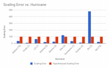

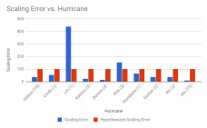

After gathering these results, the intensities of each hurricane were added to the plot in parentheses by the name of each hurricane. This was done to determine whether the intensity of a hurricane had any impact on the scaling error of the ensembles. As shown in Figures 21 and 22, this was not the case. No correlation was found between hurricane intensity and scaling error. This is seen by comparing two hurricanes of similar intensity to each other, such as Hurricane Gustav (Intensity 2) and Hurricane Ike (Intensity 2) with a lead time of zero, in Figure 21. One would expect the scaling errors to be similar across these two hurricanes if the intensity affected the scaling error. This is not the case, as Hurricane Ike had a scaling error of around 480, while Hurricane Gustav had a scaling error closer to 10.

### Conclusion

For the purpose of this study, forecast data was analyzed one week prior to, and one week following a hurricane event. The results indicate that the ensembles do not perform well when predicting the high levels of precipitation associated with hurricanes in Louisiana. The forecasts tend to significantly under-predict during storm events. This is because hurricanes form in a relatively short amount of time, and it is difficult to predict the precipitation associated with a hurricane from NMME data alone.

If additional NMME forecast data was provided, one could potentially use the forecast to determine during what months a hurricane is more likely to occur, though it is possible that the focus of the ensemble forecast period would need to be shortened. In addition, NMME forecasts could be coupled with other forecasting techniques that predict storm intensity, track, and duration. Because NMME forecasts can be an extremely beneficial tool for predictions of seasonal climate trends, they could be used as a component for determining the overall trends during hurricane seasons (summer and early fall). Although this does not provide especially accurate information about how much precipitation to expect, it may provide insight as to when other models should begin to initiate hurricane forecasts. Looking at NMME forecasts over a longer time span would also present the opportunity to determine more accurate statistics, as the mean values of the data are likely to be more accurate with the addition of other predictions.

## References

American Meteorological Society. (2007). Hurricane Forecasting in the United States. American Meteorological Society: Bulletin 88. <https://www.ametsoc.org/ams/index.cfm/about\\xadams/ams\\xadstatements/statements\\xadof\\xadthe\\xadams\\xadin>\\xad

Atlas, R. (2005). Hurricane forecasting with the high-resolution NASA finite volume general circulation model. Geophysical Research Letters, 32(3). doi:10.1029/2004gl021513

Avila, L. (2002). Tropical Cyclone Report: Hurricane Isidore. National Hurricane Center, NOAA.

Avila, L., & Cangialosi, J. (2010). Tropical Cyclone Report: Hurricane Ida. National Hurricane Center, NOAA.

Barbier, E. B., Georgiou, I. Y., Enchelmeyer, B., & Reed, D. J. (2013). The value of wetlands in protecting southeast Louisiana from hurricane storm surges. PloS one, 8(3), e58715.

Berg, R. (2009). Tropical Cyclone Report: Hurricane Ike. National Hurricane Center, NOAA.

Berg, R. (2012). Tropical Cyclone Report: Hurricane Isaac. National Hurricane Center, NOAA.

Beven, J. (2005). Tropical Cycle Report: Hurricane Dennis. National Hurricane Center, NOAA.

Beven, J. L., & Kimberlain, T. B. (2008). Tropical Cyclone Report: Hurricane Gustav. National Hurricane Center, NOAA.

Blake, E. S. (2007). Tropical Cyclone Report: Hurricane Humberto. National Hurricane Center, NOAA.

Bunya, S., et al. “A High-Resolution Coupled Riverine Flow, Tide, Wind, Wind Wave, and Storm Surge Model for Southern Louisiana and Mississippi. Part I: Model Development and Validation.” Monthly Weather Review, vol. 138, no. 2, 1 Feb. 2010, pp. 345–377., doi:10.1175/2009mwr2906.1.

Cangialosi, John P, and James L Franklin. “NATIONAL HURRICANE CENTER FORECAST VERIFICATION REPORT.” National Hurricane Center Forecast Verification, 4 Apr. 2017, <www.nhc.noaa.gov/verification/>.

Chen, Xing, et al. “Variations in Streamflow Response to Large Hurricane-Season Storms in a Southeastern U.S. Watershed.” Journal of Hydrometeorology, vol. 16, no. 1, 4 Feb. 2015, pp. 55–69., doi:10.1175/jhm-d-14-0044.1.

Dolfman, Michael L.; Wasser, Solidelle Fortier; Bergman, Bruce. (2007). The Effects of Hurricane Katrina on the New Orleans Economy. Monthly Labor Review, 1-18.

Economics and Statistics Administration (ESA). (2006). The Gulf Coast: Economic Impact & Recovery One Year after the Hurricanes. U.S. Department of Commerce.

Federal Trade Commission. (2006). Investigation of Gasoline Price Manipulation and Post-Katrina Gasoline Price Increases. United States.

Gopalakrishnan, S. G., Bacon, D. P., Ahmad, N. A. N., Boybeyi, Z., Dunn, T. J., Hall, M. S., ... & Sarma, A. (2002). An operational multiscale hurricane forecasting system. Monthly Weather Review, 130(7), 1830-1847.

Harnos, D. S., Schemm, J. K. E., Wang, H., & Finan, C. A. (2017). NMME\\xadbased hybrid prediction of Atlantic hurricane season activity. Climate Dynamics, 1\\xad19.

Impact Assessment Inc. (2007). Preliminary Assessment of the Impacts of Hurricane Katrina on Gulf of Mexico Coastal Fishing Communities. U.S. Department of Commerce.

Jagger, Thomas H., and James B. Elsner. “A Consensus Model for Seasonal Hurricane Prediction.” Journal of Climate, vol. 23, no. 22, 2010, pp. 6090–6099., doi:10.1175/2010jcli3686.1.

Jia, P., Joyner, A., & Sun, Y. (2014). Short\\xadterm associations between accumulated rainfall and atmospheric moisture during landfall of three Atlantic hurricanes. The Geographical Bulletin, 55 (1), 49.

Knabb, R., Brown, D., & Rhome, J. (2006). Tropical Cyclone Report: Hurricane Rita. National Hurricane Center, NOAA.

Knabb, R., Rhome, J., & Brown, D. (2005). Tropical Cyclone Report: Hurricane Katrina. National Hurricane Center, NOAA.

Lawrence, M. B. (2002). Tropical Cyclone Report: Hurricane Lili. National Hurricane Center, NOAA.

Murakami, H., Villarini, G., Vecchi, G. A., Zhang, W., & Gudgel, R. (2016). Statistical–dynamical seasonal forecast of North Atlantic and US landfalling tropical cyclones using the high-resolution GFDL FLOR coupled model. Monthly Weather Review, 144(6), 2101-2123.

National Aeronautics and Space Administration (NASA). (2015) Precipitation Measurement Missions. <https://pmm.nasa.gov/trmm>.

National Atmospheric and Oceanic Administration (NOAA). 2017. Improving the accuracy and reliability of hurricane forecasts. Miami, FL: National Hurricane Center. <http://www.hfip.org/documents/HFIP_StrategicPlan_Yrs5-10_Nov05_2014_Update.pdf>

National Atmospheric and Oceanic Administration (NOAA). 2017. Saffir-Simpson Hurricane Wind Scale. Miami, FL: National Hurricane Center. <http://www.nhc.noaa.gov/aboutsshws.php>.

National Center for Atmospheric Research. (2017). Project: NMME CanCM4 data. NCAR Climate Data Gateway, <https://www.earthsystemgrid.org/project/nmme.html>

Steward, J. S., Virnstein, R. W., Lasi, M. A., Morris, L. J., Miller, J. D., Hall, L. M., & Tweedale, W. A. (2006). The impacts of the 2004 hurricanes on hydrology, water quality, and seagrass in the central Indian River Lagoon, Florida. Estuaries and Coasts, 29(6), 954-965.

Stewart, S. R. (2006). Tropical Cycle Report: Hurricane Cindy. National Hurricane Center, NOAA.

Stone, G. W., Grymes III, J. M., Dingler, J. R., & Pepper, D. A. (1997). Overview and significance of hurricanes on the Louisiana coast, USA. Journal of Coastal Research, 656-669.

Tallapragada, V., Bernardet, L., Gopalakrishnan, S., Kwon, Y., Liu, Q., Marchok, T., ... & Yablonsky, R. (2014). Hurricane Weather Research and Forecasting (HWRF) model: 2013 scientific documentation. HWRF Development Testbed Center Tech. Rep, 99.

United States, Congress, National Hurricane Center, and Eric S Blake. “Tropical Cyclone Report: Hurricane Humberto.” Tropical Cyclone Report: Hurricane Humberto, National Hurricane Center, 28 Nov. 2007. <www.nhc.noaa.gov/data/tcr/AL092007_Humberto.pdf>.

Wamsley, T. V., Cialone, M. A., Smith, J. M., Atkinson, J. H., & Rosati, J. D. (2010). The potential of wetlands in reducing storm surge. Ocean Engineering, 37(1), 59-68.

Westerink, Joannes J., et al. “A Basin-to-Channel-Scale Unstructured Grid Hurricane Storm Surge Model Applied to Southern Louisiana.” Monthly Weather Review, vol. 136, no. 3, 1 Mar. 2008, pp. 833–864., doi:10.1175/2007mwr1946.1.

World Meteorological Organization (WMO). 2012. Guidelines on Ensemble Prediction Systems and Forecasting. Geneva, Switzerland. <http://www.wmo.int/pages/prog/www/Documents/1091_en.pdf>
